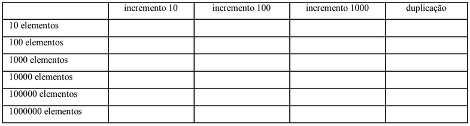

# Questão 2

Utilizando os arquivos PilhaArray.java, Pilha.java, TestePilha.java,
preencha a tabela abaixo, onde a linha superior diz o método de aumento da capacidade e a coluna da esquerda
informa a quantidade de elementos colocados na pilha. Em cada célula da tabela deverá ser colocado o tempo,
em milisegundos (use System.currentTimeMillis()), de se colocar os elementos. Utilize as duas estratégias de
crescimento (constante e duplicação) para o array.

Sugestão: Tente implementar a interface Pilha.java e use o arquivo PilhaArray.java só em último caso para tirar
dúvidas.

##

## resposta:
    a fazer ...